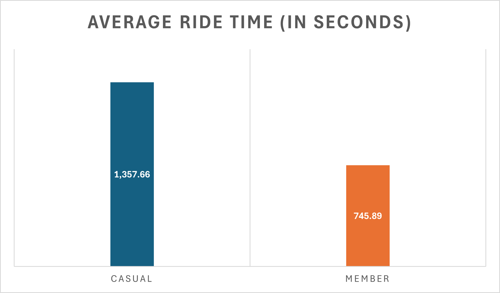
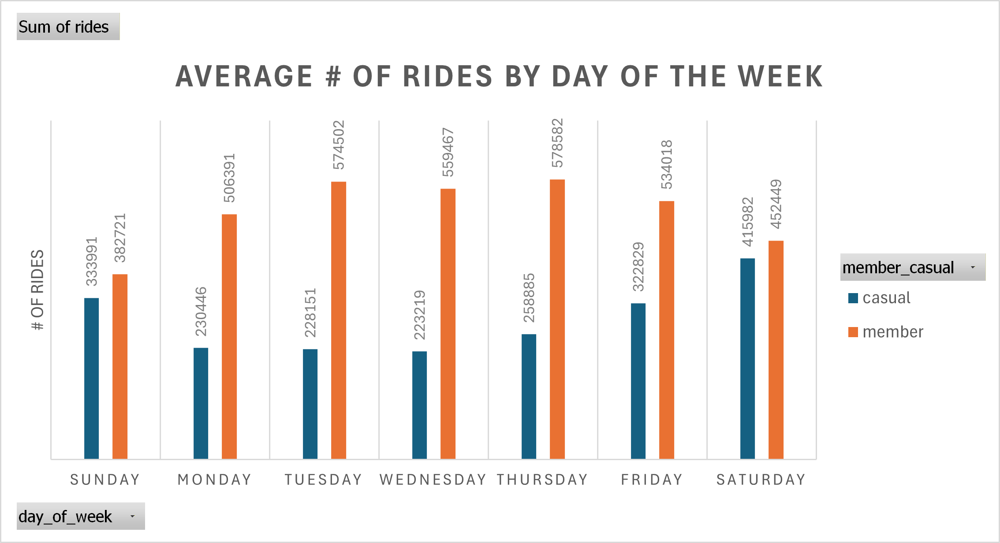
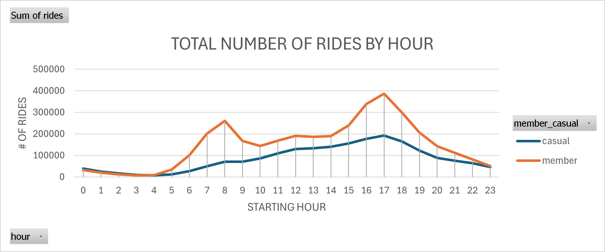

# Cyclistic Bike Share Analysis

## Project Overview

This project analyzes 12 months of bike share data from Cyclistic to identify behavioral differences between annual members and casual riders. The goal of the analysis is to provide insights that can support marketing strategies aimed at converting casual riders into annual members.

---

## Business Task

Cyclistic’s marketing team wants to understand:

**How do annual members and casual riders use bikes differently?**

The results of this analysis will help inform targeted marketing campaigns designed to increase annual memberships.

---

## Tools Used

- SQL in Google BigQuery
- Microsoft Excel for data cleaning
- Microsoft Excel for data visualization
- GitHub for project documentation and portfolio presentation

---

## Data Source

The dataset consists of 12 months of Cyclistic trip data including:

- ride start time
- ride end time
- bike type
- rider category (member or casual)

The dataset was cleaned and prepared before analysis.

---

## Data Cleaning Process

Key cleaning steps included:

- Removing rides with missing or invalid ride lengths
- Creating a `ride_length` column to calculate trip duration
- Creating a `day_of_week` column from ride start timestamps
- Standardizing data formats across monthly datasets

---

## Analysis

The analysis focused on identifying differences in usage patterns between member and casual riders.

Key metrics analyzed:

- Total ride count
- Average ride length
- Ride frequency by day of week
- Ride frequency by hour of day
- Bike type usage

SQL queries used for the analysis can be found in the **sql/** folder.

---

## Key Insights

### Casual riders take longer rides

Casual riders have a higher average ride length than annual members, suggesting more recreational use.



---

### Casual riders ride primarily on weekends

Ride activity from casual riders peaks on Saturdays and Sundays, while members ride more consistently throughout the week.



---

### Members show commuting patterns

Members demonstrate higher usage during weekday commuting hours.



---

## Recommendations

Based on the analysis, the following strategies may help convert casual riders into annual members:

1. Target weekend riders with promotional membership offers.
2. Promote membership benefits for frequent recreational riders.
3. Offer commuter-focused membership incentives.

---

## Repository Structure

```
cyclistic-bike-share-analysis
│
├── data                # Dataset documentation
├── sql                 # SQL queries used for analysis
├── visualizations      # Charts and graphs
└── reports             # Full case study report
```

---

## Author

Noah Irby  
Google Data Analytics Certificate Project
